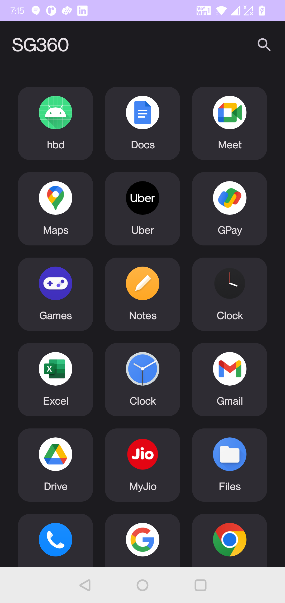
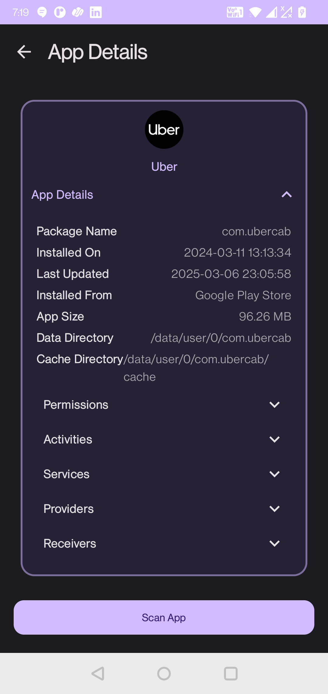
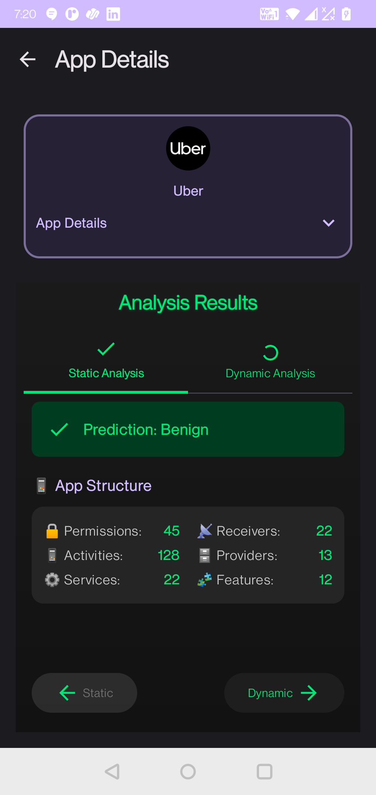

# SG360 - Android Malware Detection

SG360 is a cutting-edge, open-source malware detection application for Android that leverages federated learning and AI to provide robust security while preserving user privacy.

## 🛡️ Overview

SG360 is the companion app for [Sangraha360](https://sangraha360.org), a comprehensive security platform. This application implements state-of-the-art techniques in malware detection without compromising user data privacy through our innovative federated learning approach.

Unlike traditional security apps that require significant permissions and send data to the cloud, SG360 performs most analysis locally on your device, sharing only anonymized model updates that cannot be traced back to individual users.

## ✨ Key Features

- **Advanced Malware Detection**: AI-powered algorithms detect potential threats with high accuracy
- **Privacy-Preserving Architecture**: Federated learning enables collaborative model improvement without sharing sensitive data
- **Static & Dynamic Analysis**: Comprehensive scanning of APKs for suspicious behavior and patterns
- **Minimal Permissions Required**: Respects your privacy by requesting only essential permissions
- **Intuitive User Interface**: Clean, modern design for seamless user experience
- **Offline Analysis Capabilities**: Core functionality works without an internet connection
- **Zero Ads**: Completely ad-free experience
- **Open Source**: Transparent codebase available for review and contribution

## 📱 Screenshots

  
  
  

## 🚀 Getting Started

### Installation
#### Direct APK Installation
1. Download the latest APK from our [GitHub Releases](https://github.com/cyberguard360/ngit-sangraha360.org/releases)
2. Enable installation from unknown sources in your device settings
3. Open the downloaded APK and follow the installation prompts

## 📊 How It Works

SG360 employs a multi-layered approach to malware detection:

1. **Static Analysis**: Examines APK files without execution to identify suspicious patterns
2. **Dynamic Analysis**: Monitors app behavior in a controlled environment to detect malicious activities
3. **Federated Learning**: Collaboratively improves detection models across devices while preserving privacy
4. **Local Decision Engine**: Makes security recommendations based on comprehensive analysis

## 📋 Required Permissions

SG360 is designed to be minimally invasive. On Android 6.0+, the app requires:
- Network Access: For model updates and account verification
- Storage Access: For analyzing installed applications

On Android versions prior to 6.0, additional permissions are automatically granted:
- View Network Connections: To monitor potential network-based threats
- Run at startup: For continuous protection
- Read/write access to external storage: For analyzing installed applications

## 🔧 Technical Documentation

### Architecture

SG360 follows a clean architecture approach with three main layers:
- **Presentation Layer**: UI components built with Jetpack Compose
- **Domain Layer**: Business logic and use cases
- **Data Layer**: Remote API communication and local storage

The app implements the MVVM pattern with Kotlin coroutines and Flow for reactive programming.

### Key Dependencies

- **Kotlin Coroutines & Flow**: For asynchronous programming
- **Jetpack Compose**: Modern UI toolkit
- **Retrofit & OkHttp**: Network communication
- **Room**: Local database storage
- **Dagger-Hilt**: Dependency injection
- **TensorFlow Lite**: On-device machine learning

## 📝 Blog Posts

Stay updated with our latest developments and cybersecurity insights:

- [How Federated Learning is helping in Revolutionizing User Privacy](https://sangraha360.org/blog/blogs/blog4)
- [Deep Dive into TFLite On-Device Training](https://sangraha360.org/blog/blogs/blog5)
- [Drift Detection Algorithms in Federated Learning](https://sangraha360.org/blog/blogs/blog3)
- [Securing the Mobile Landscape with Federated Learning](https://medium.com/@akshaynagamalla23/securing-the-mobile-landscape-with-federated-learning-%EF%B8%8F-f86a28d82efa)

## 🤝 Contributing

We welcome contributions to the SG360 project! Here's how you can help:

1. Fork the repository
2. Create your feature branch (`git checkout -b feature/amazing-feature`)
3. Commit your changes (`git commit -m 'Add some amazing feature'`)
4. Push to the branch (`git push origin feature/amazing-feature`)
5. Open a Pull Request

## 📊 Research & Publications

SG360's technology is based on published research in federated learning and malware detection:
- [Sangraha360: An Unknown Malware Detection Framework with Federated Learning and Drift Detection](https://ijisae.org/index.php/IJISAE/article/view/4978)

## 📞 Support & Community

- Connect with us on [LinkedIn](https://www.linkedin.com/company/sangraha360)
- Visit our [Forum](https://sangraha360.org/contactus)
- Read our [Blog](https://sangraha360.org/blog)

---

   
  Developed by the Sangraha360 Team

